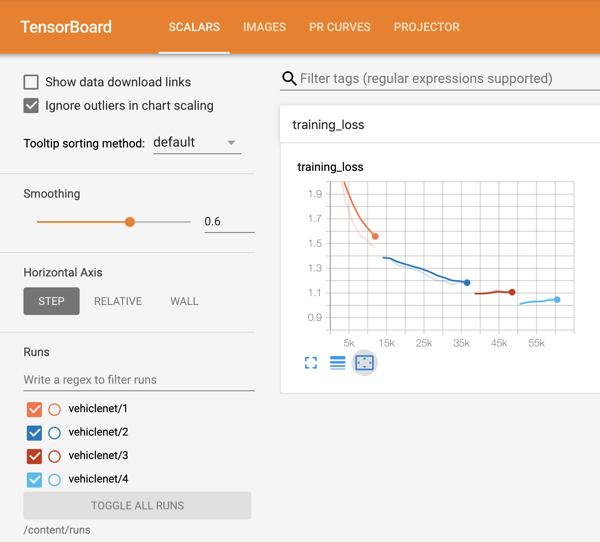

Machine Learning Example CNN
============================

VehicleNet is a simple implementation of a CNN to classify the CIFAR20 database of images.
It is based initially on the [PyTorch Tutorial](https://pytorch.org/tutorials/beginner/blitz/cifar10_tutorial.html), 
but develops that sample code with 
    * TensorBoard Integration, 
    * Persistent Model State, 
    * PyPi compatible package allowing pip install, and more.
    
This python main module provides a simple command line interface to the API, 
which is also available in the [GMcD_ML](https://github.com/GMcD/MachineLearning/blob/master/GMcD_ML.ipynb) 
Jupyter notebook.

[](https://colab.research.google.com/github/GMcD/MachineLearning/blob/master/GMcD_ML.ipynb)

> If TensorBoard integration fails to show inline, try whitelisting CoLab and 
> GoogleUserContent in Third Party Cookies.

Scalars
-------
TensorBoard integration logs the Training Loss scalar. 


Projections
-----------
Embeddings are logged during each training run.


Precision Recall Curves
-----------------------
Improvements in Precision Recall over training runs. 


Class Interface
---------------
```python
class VehicleNet(object):
    """
    CNN Model controller - interfaces between model runs, persists state, creates Net instances
    and collects training and test data
    """

    def getState(self) :
        """
        Collect state from persistent store of model runs and state
        """

    def clearState(self):
        """
        Clear any persistent state, and reinitialise from a blank state
        """

    def setWriter(self):
        """
        Create folder for TensorBoard stats and initialise writer
        """

    def setOptimizer(self):
        """
        Set the optimizer for the CNN
        """

    def setNetwork(self):
        """
        Load stored ModelState if present, otherwise start from afresh
        """

    def loadNetwork(self):
        """
        Load stored model state
        """

    def saveNetwork(self):
        """
        Restore model state
        """

    def setImageData(self):
        """
        Load torchvision.datasets.CIFAR10 dataset
        """

    def __init__(self):
        """
        Get state, setup network, and download data
        """

    def trainAndReport(self, iterations=1, samples=2000):
        """
        Initialse TensotBoard Writer, Train Network, Report and Save
        """
```
